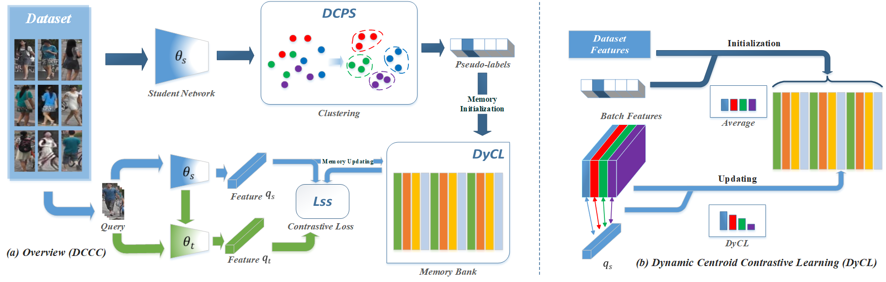
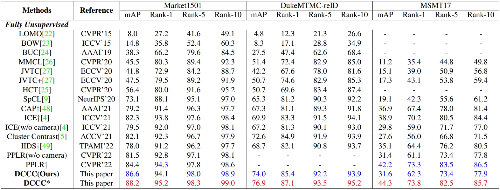

# Dynamic Clustering and Cluster Contrastive Learning (DCCC)

The **_official_** repository for [Dynamic Clustering and Cluster Contrastive Learning for Unsupervised Person Re-ID with Feature Distribution Alignment](https://arxiv.org/abs/2303.06810) achieves state-of-the-art performances on 3 commonly used person re-ID including MSMT17, Market-1501 and DukeMTMC.



## What's New

[2023-12-14] Our work has been accepted by [ICASSP 2024](https://2024.ieeeicassp.org/)!

## Performance



## Requirements

```shell
pip install -r requirements.txt
```

### Installation

```shell
python setup.py develop
```

### Prepare Datasets

```shell
cd examples && mkdir data
```

Download the person datasets [Market-1501](https://drive.google.com/file/d/0B8-rUzbwVRk0c054eEozWG9COHM/view), [MSMT17](https://arxiv.org/abs/1711.08565), and DukeMTMC-reID.
Then unzip them under the directory like

```
DCCC/examples/data
├── market1501
│   └── Market-1501-v15.09.15
├── dukemtmcreid
│   └── DukeMTMC-reID
├── msmt17
│   └── MSMT17_V1
```

### Prepare ImageNet Pre-trained Models for IBN-Net

When training with the backbone of [IBN-ResNet](https://arxiv.org/abs/1807.09441), you need to download the ImageNet-pretrained model from this [link](https://drive.google.com/drive/folders/1thS2B8UOSBi_cJX6zRy6YYRwz_nVFI_S) and save it under the path of `logs/pretrained/`.

```shell
mkdir logs && cd logs
mkdir pretrained
```

The file tree should be

```
DCCC/logs
└── pretrained
    └── resnet50_ibn_a.pth.tar
```

ImageNet-pretrained models for **ResNet-50** will be automatically downloaded in the python script.

## Training

We utilize 4 Telsa V100 GPUs for training. **Note that**

- use `--iters 200` (default) for datasets;
- use `--width 128 --height 256` (default) for person datasets;
- use `-a resnet50` (default) for the backbone of ResNet-50, and `-a resnet_ibn50a` for the backbone of IBN-ResNet.

To train the model(s) in the paper, run this command:

```shell
bash train.sh
```

## Evaluation

We utilize 1 Telsa V100 GPU for testing. **Note that**

- use `--width 128 --height 256` (default) for person datasets;
- use `-a resnet50` (default) for the backbone of ResNet-50, and `-a resnet_ibn50a` for the backbone of IBN-ResNet.

To evaluate the model, run:

```shell
### Market-1501 ###
CUDA_VISIBLE_DEVICES=0 \
python examples/test.py \
  -d market1501 --resume logs/dccc/market_resnet50/model_best.pth.tar
```

## Acknowledgements

Our DCCC partially refers open-sourced [SpCL](https://github.com/yxgeee/SpCL), we thank their awesome contribution.

## Citation

If you find this code useful for your research, please cite our paper

```shell
@article{He2023DynamicCA,
  title={Dynamic Clustering and Cluster Contrastive Learning for Unsupervised Person Re-identification},
  author={Ziqi He and Mengjia Xue and Yunhao Du and Zhicheng Zhao and Fei Su},
  journal={ArXiv},
  year={2023},
  volume={abs/2303.06810},
  url={https://api.semanticscholar.org/CorpusID:257496756}
}
```
